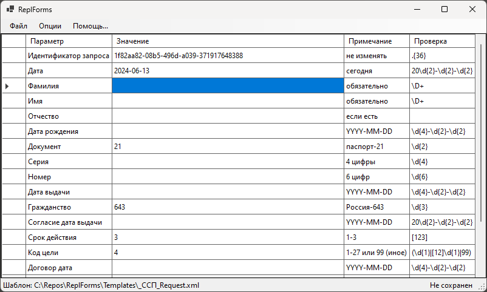

# ReplForms
Replaces every `key[;value;remark;regexp]` in a template XML file with
DataGridView inserted and validated values.

Заменяет каждый `Параметр[:Значение:Примечание:RegExp]` в файле шаблона
(XML или другом) в наглядной сетке с опциональной проверкой введенных
полей на соответствие прилагаемям регулярным выражениям.

## Help / Помощь

Шаблон - это XML (или другой) файл,
где есть такие варианты специальных полей шаблона:

    `Параметр'
    `Параметр;Примечание'
    `Параметр;Значение;'
    `Параметр;Значение;Примечание'
    `Параметр;Значение;Примечание;RegExp'

Поле "Значение" (значение по умолчанию) может делать автозамену:
- `GUID`
- `YYYY-MM-DD`

Если поле "Примечание" содержит разделитель `|`, то при клике по строке в
таблице будет возникать контекстное меню из указанных строк пунктов меню,
а при выборе - подставляться. К значениям пунктов меню можно приписывать
пояснение через ` - ` (оно не будет подставлено).

Опция в меню "Заменять все" - сделает замену всех таких параметров далее.

Опциональным параметром запуска можно указать, какой файл шаблона открыть
сразу и опционально следующим - в какой файл сохранить результат:

    [Шаблон [Результат]]

В имени файла можно делать автозамену:

- `{GUID}`
- `{YYYY-MM-DD}`

Опции запуска:

- `-1` - отключить опцию "Заменять все",
- `-1251` - кодировка windows-1251 в текстовых шаблонах.

## Examples / Примеры

В папке [Templates](Templates) есть несколько примеров.
Для кодировки 1251 (если символы вдруг не отображаются на этом сайте
в этой кодировке - было такое) есть параллельный в UTF-8.

- `_ED462-{YYYY-MM-DD}-utf8.xml` - файл в формате УФЭБС в кодировке
utf8 (для отображения на этом сайте);
- `_ED462-{YYYY-MM-DD}-win1251.xml` - файл в формате УФЭБС в рабочей
кодировке windows-1251;
- `_ССП_Request.xml` - файл запроса в КБКИ (см. транспортную программу
<https://github.com/diev/Api5704>).

## Requirements / Требования

- .NET 8 Desktop Runtime

## Build / Построение

Build this Project with many dlls into a Distr folder:

    dotnet publish Project.csproj -o Distr

Build this Project as a single-file app when NET Desktop runtime required:

    dotnet publish Project.csproj -o Distr -r win-x64 -p:PublishSingleFile=true --self-contained false

Build this Project as a single-file app when no runtime required:

    dotnet publish Project.csproj -o Distr -r win-x64 -p:PublishSingleFile=true

## License / Лицензия

Licensed under the [Apache License, Version 2.0].

[Apache License, Version 2.0]: LICENSE
